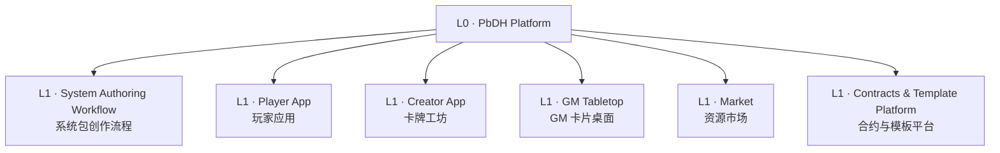
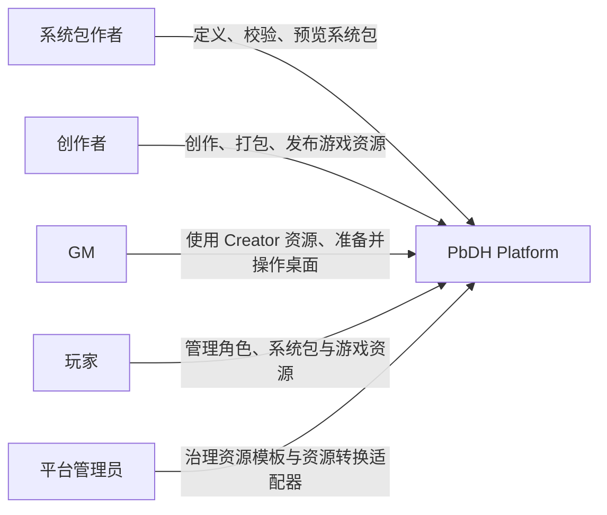
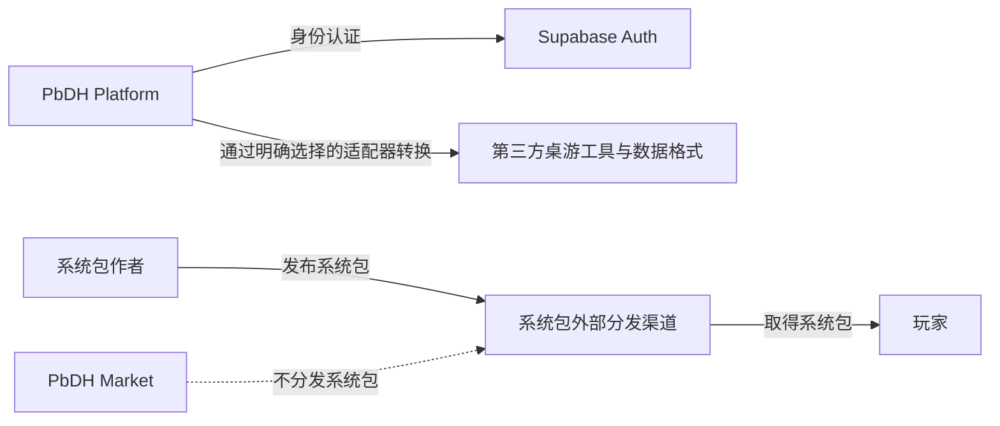
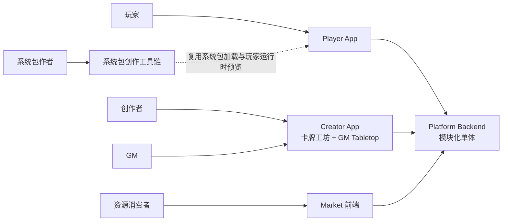
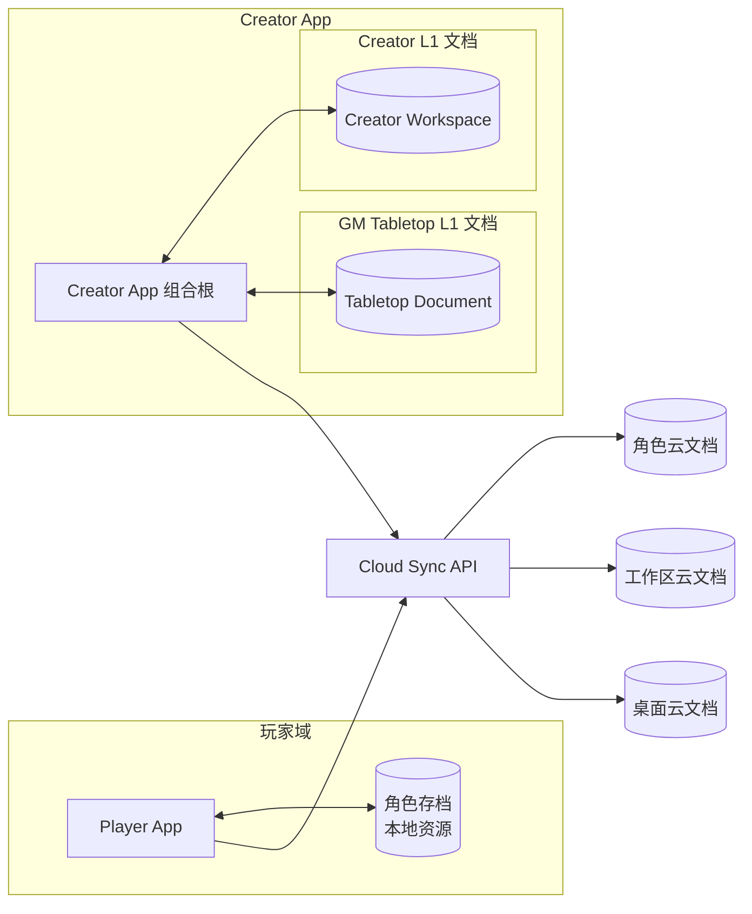
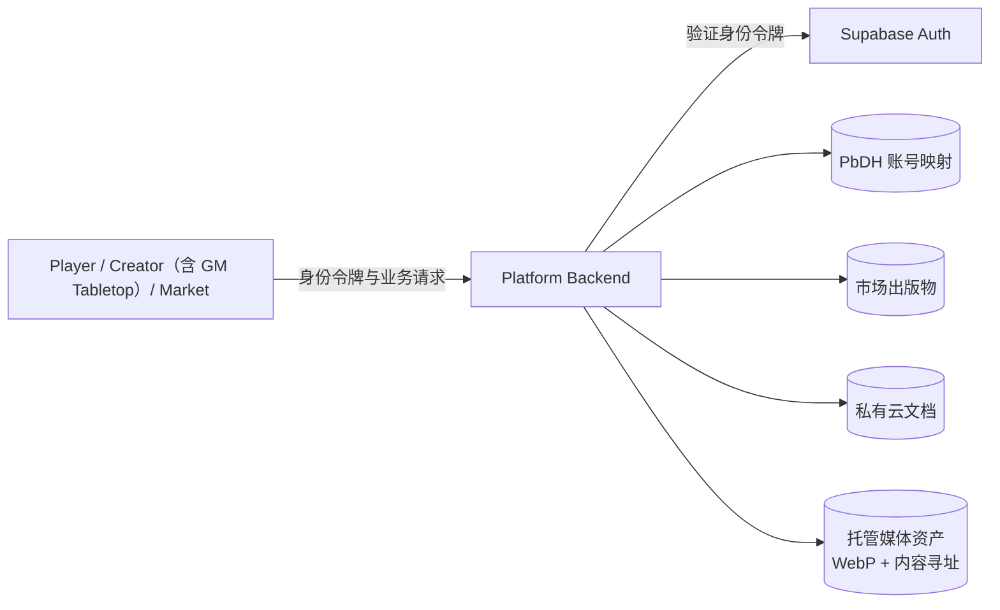
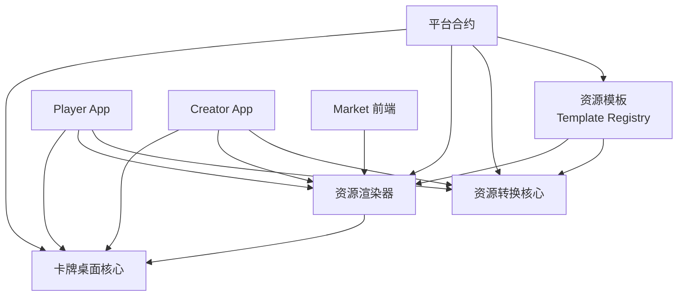
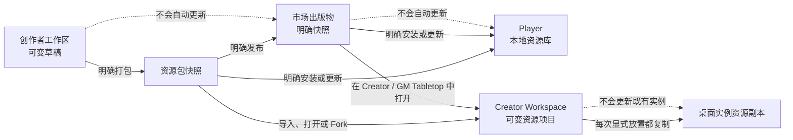

# PbDH 平台 C4 架构图

本文记录 PbDH 平台当前已经确定的系统上下文与运行容器。为避免连线交叉，每个关注点使用独立视图；这些视图共同构成当前 C4 模型，不应合并为一张总图。

## 阅读规则

- 产品 PRD 层级与 C4 层级是两套不同视角。
- PRD L1 按用户价值和产品验收边界划分；C4 Container 按运行、部署和存储边界划分。
- `Platform Backend` 是 C4 Container 和部署边界，不是产品 L1。
- `Contracts & Template Platform` 是产品 L1，但不对应一个必须在线运行的同名容器。
- 尚未由 L1/L2 PRD 定义的 C4 Component 与 Code 结构不在本文预设。
- 箭头表示依赖或数据流向，不表示共享数据所有权。

## 产品视图（非 C4）

此图仅用于说明产品 PRD 层级，防止将产品与运行容器混淆。

## C4 L1：系统上下文

### 用户与平台

此图回答：哪些角色使用 PbDH 平台，各自获得什么能力？

### 平台外部依赖

此图回答：PbDH 平台与哪些外部系统交互？

## C4 L2：运行容器

### 产品入口与后端

此图回答：用户分别进入哪个前端，哪些前端使用自托管后端？

`Platform Backend` 为一个自托管模块化单体，提供身份映射、云同步、托管媒体和市场 API。它服务多个产品，但自身不是产品 L1。

### 本地优先与云同步

此图回答：哪些文档在本地保存并同步到云端？统一账号不合并这些领域数据。

Cloud Sync 共享同步机制，不创建跨领域统一工作区，也不授予一个领域修改另一个领域文档的权限。

### 账号、业务数据与媒体

此图回答：Supabase 与自托管基础设施分别保存什么？

Supabase 只承担外部身份认证，不保存 PbDH 结构化业务数据或媒体资产。

### 共享运行能力

此图回答：前端如何复用合约、模板、渲染、转换与桌面能力？图中连接表示构建或运行时模块依赖，不是网络调用。

共享模块不拥有应用数据，不形成共享可变状态，也不要求各应用锁步发布。应用组合根负责解析资源模板并注入所需能力。

## 关键动态视图：资源快照流转

此图不是新的容器图，用于补充 C4 静态结构无法表达的更新边界。

资源更新以显式快照替换为边界：创作者编辑不会自动更新市场；市场发布不会自动更新 Player 或 Creator Workspace；Creator Workspace 修改不会改变既有桌面实例。Market 打开 GM Tabletop 时只导入或打开完整 Workspace 并聚焦上下文，不能自动放置。

## C4 L3/L4：待后续定义

| 容器或模块 | C4 L3 Component 状态 | 继续定义的前提 |
| --- | --- | --- |
| 系统包创作工具链 | 留白 | System Authoring Workflow L1/L2 PRD |
| Player App | 留白 | Player App L1/L2 PRD |
| Creator App | 留白 | Creator App L1/L2 PRD |
| Creator App 内 GM Tabletop | 留白 | GM Tabletop L1/L2 PRD |
| Market 前端 | 留白 | Market L1/L2 PRD |
| Platform Backend | 留白 | 各产品的云同步、媒体与市场能力边界 |
| 合约、模板及共享模块 | 留白 | Contracts & Template Platform L1/L2 PRD |

C4 L4 Code 图仅在具体实现复杂到需要解释代码结构时创建，不作为所有模块的强制文档。
